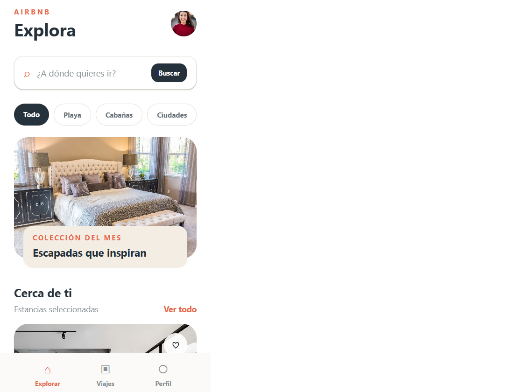

# Airbnb UI

Maqueta de tres pantallas inspirada en Airbnb: **Explora**, **Viajes** y **Perfil**. La pantalla principal incluye búsqueda funcional, filtros por categoría, tarjetas de alojamientos y favoritos; la barra inferior cambia de vista con estado local.

La interfaz está construida con componentes nativos de React Native y clases utilitarias de NativeWind, sin `StyleSheet.create()`. Incluye `SafeAreaView`, `ScrollView`, un `TextInput`, imágenes remotas y botones `Pressable` con estados de interacción.

